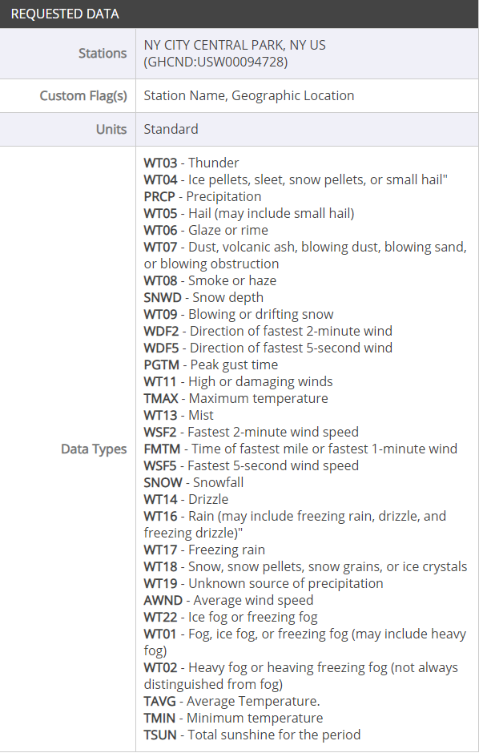

## Objective

Gather Historical Weather Data and store them into Big Query, then take weather into account for training  

Many websites offer to provide you with external data than can enhance your model performance, often at a cost. Today, we work with the [National Centers for Environmental Information](https://www.ncei.noaa.gov/). This website allows you to extract historical weather data from many stations located around the world. Let's see how it works.

## Get the data

Go on the website [homepage](https://www.ncei.noaa.gov/). Now it is your turn to find how to retrieve a custom csv with the needed data : we are looking for daily weather summaries for the station called 'NY CITY CENTRAL PARK, NY US'. You will be asked to provide a first and last date for the report. By running a query in the BigQuery UI, can you determine how to answer this question ?

Our final dataset should have the attributes you can see in the dictionary below.

## Push data to cloud

Once you have the information downloaded as a csv, upload it in a Big Query table. Now run a query to merge both datasets, and use the weather table to enrich your training dataset.

## Data exploration (Data Studio)

Data Studio is a Free visualisation Tool built integrated in the GCP. You can pug it on various objects (Big Query Table, CSV, Cloud SQL Table). Create a new report with this tool to get familiar with your updated dataset.

## Model Improvement

Now that you have this updated dataset, work on updating your model to improve it's performance. Good luck !
